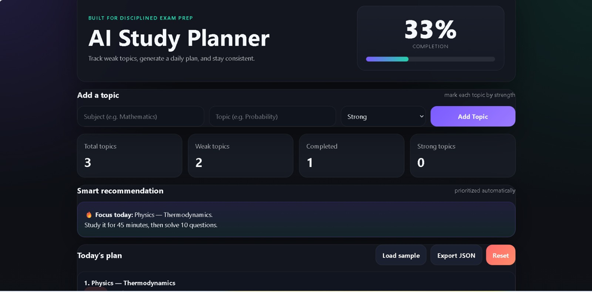
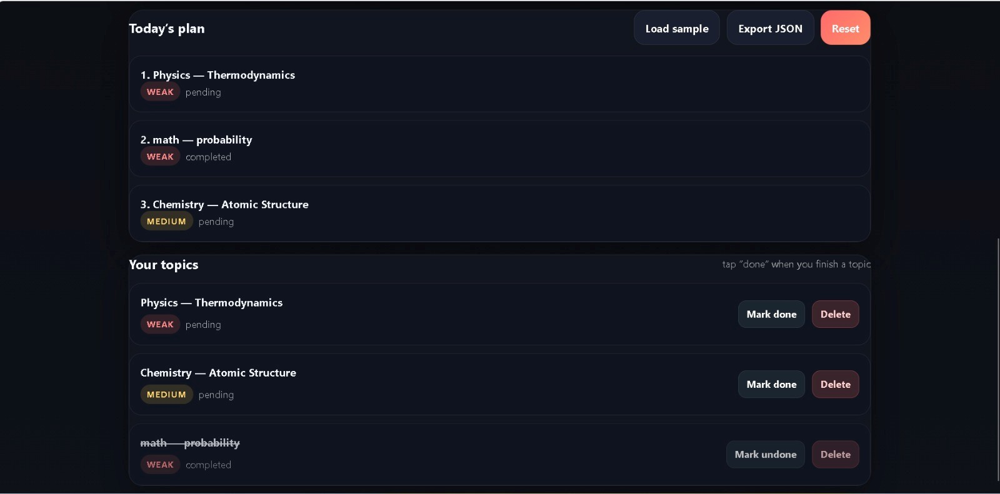

# 🌸 AI Study Planner ✨

A smart and aesthetic study planner designed to help students stay organized, identify weak topics, and study with focus 📚💖

---

## 🌷 Overview
Preparing for competitive exams can feel overwhelming and unstructured.  
This project transforms that chaos into a clear, focused study system.

Users can track subjects, identify weak areas, and receive smart recommendations to improve consistency and efficiency.

---

## 💡 Why I Built This
As a student preparing for exams, I realized that the biggest challenge is not studying — but **knowing what to study next**.

This project is my attempt to solve that problem by prioritizing weak topics and helping maintain a consistent study flow.

---

## 💕 Features
- 📝 Add subjects and topics  
- 🌈 Classify topics (Strong / Medium / Weak)  
- 🎯 Smart recommendation system  
- 📊 Progress tracking dashboard  
- 💾 Auto-save using local storage  
- 📤 Export study data as JSON  

---

## 🧠 Smart Logic
The system prioritizes:
- Weak topics first  
- Incomplete topics next  

This ensures users always focus on the most important areas.

---

## 🧠 How It Works
1. Add your subject and topic  
2. Select your strength level  
3. The system analyzes your data  
4. Weak topics are prioritized  
5. Get a daily focus recommendation 🔥  
6. Track progress as you improve 📈  

---

## 🛠 Tech Stack
- HTML  
- CSS  
- JavaScript  

---

## 🌐 Live Demo
👉 https://shreyaghosh0605-alt.github.io/ai-study-planner/

---

## 📷 Preview

### Dashboard View

### Task & Plan View

---

## 🚀 Future Improvements
- 📊 Advanced analytics & charts  
- 🤖 Real AI-based recommendations  
- ⏰ Study timer & reminders  
- 🎨 Multiple UI themes  

---

## 👩‍💻 Author
**Shreya 💖**  
Building simple and meaningful tools to make studying smarter ✨
